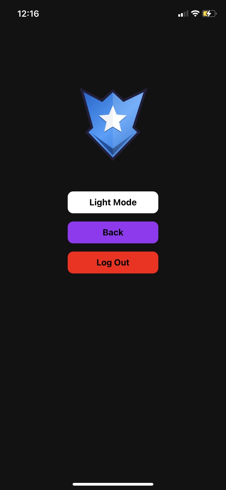

<Text>1. Home Page --- 2. Settings --- 3. Light Mode</Text> 

   

  
<Text>1. Workout Log ---  2. Workout Details --- 3. Exercise Graph</Text>

  

<Text>1. Chat Screen ---  2. Comments Screen  </Text>

 

<Text>1. Initial Macros Screen --- 2. Meal Log --- 3. Edit Meal (editing milk) --- 4. Manually Add Meal 

    

5. Search Food API --- 6. Adjust Macros Page --- 7. Macro Calculator

  

1. Weight Log --- 2. Weight Log List

   

